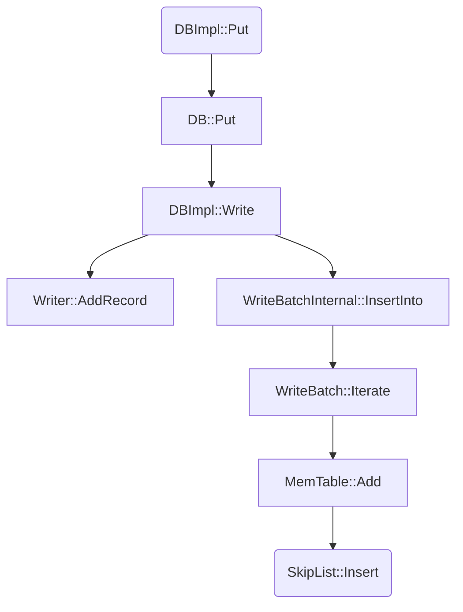

## 写流程

### 插入到 MemTable

#### 流程图


#### 具体代码分析

- DBImpl::Put

直接调用 `DB::Put`
```cpp
Status DBImpl::Put(const WriteOptions& o, const Slice& key, const Slice& val) {
  return DB::Put(o, key, val);
}
```

- DB::Put

```cpp
Status DB::Put(const WriteOptions& opt, const Slice& key, const Slice& value) {
  WriteBatch batch;
  batch.Put(key, value); // 把key value 放入到 WriteBatch 中，具体是把key value 编码为字符串存入writebatch的内部成员中
  return Write(opt, &batch);
}
```

- DBImpl::Write

```cpp
Status DBImpl::Write(const WriteOptions& options, WriteBatch* updates) {
  Writer w(&mutex_);
  w.batch = updates;
  w.sync = options.sync;
  w.done = false;

  MutexLock l(&mutex_);
  writers_.push_back(&w);
  while (!w.done && &w != writers_.front()) {
    w.cv.Wait();
  }
  if (w.done) {
    return w.status;
  }

  // May temporarily unlock and wait.
  Status status = MakeRoomForWrite(updates == nullptr);
  uint64_t last_sequence = versions_->LastSequence();
  Writer* last_writer = &w;
  if (status.ok() && updates != nullptr) {  // nullptr batch is for compactions
    WriteBatch* write_batch = BuildBatchGroup(&last_writer);
    WriteBatchInternal::SetSequence(write_batch, last_sequence + 1);
    last_sequence += WriteBatchInternal::Count(write_batch);

    // Add to log and apply to memtable.  We can release the lock
    // during this phase since &w is currently responsible for logging
    // and protects against concurrent loggers and concurrent writes
    // into mem_.
    {
      mutex_.Unlock();
      status = log_->AddRecord(WriteBatchInternal::Contents(write_batch));
      bool sync_error = false;
      if (status.ok() && options.sync) {
        status = logfile_->Sync();
        if (!status.ok()) {
          sync_error = true;
        }
      }
      if (status.ok()) {
        status = WriteBatchInternal::InsertInto(write_batch, mem_);
      }
      mutex_.Lock();
      if (sync_error) {
        // The state of the log file is indeterminate: the log record we
        // just added may or may not show up when the DB is re-opened.
        // So we force the DB into a mode where all future writes fail.
        RecordBackgroundError(status);
      }
    }
    if (write_batch == tmp_batch_) tmp_batch_->Clear();

    versions_->SetLastSequence(last_sequence);
  }

  while (true) {
    Writer* ready = writers_.front();
    writers_.pop_front();
    if (ready != &w) {
      ready->status = status;
      ready->done = true;
      ready->cv.Signal();
    }
    if (ready == last_writer) break;
  }

  // Notify new head of write queue
  if (!writers_.empty()) {
    writers_.front()->cv.Signal();
  }

  return status;
}
```