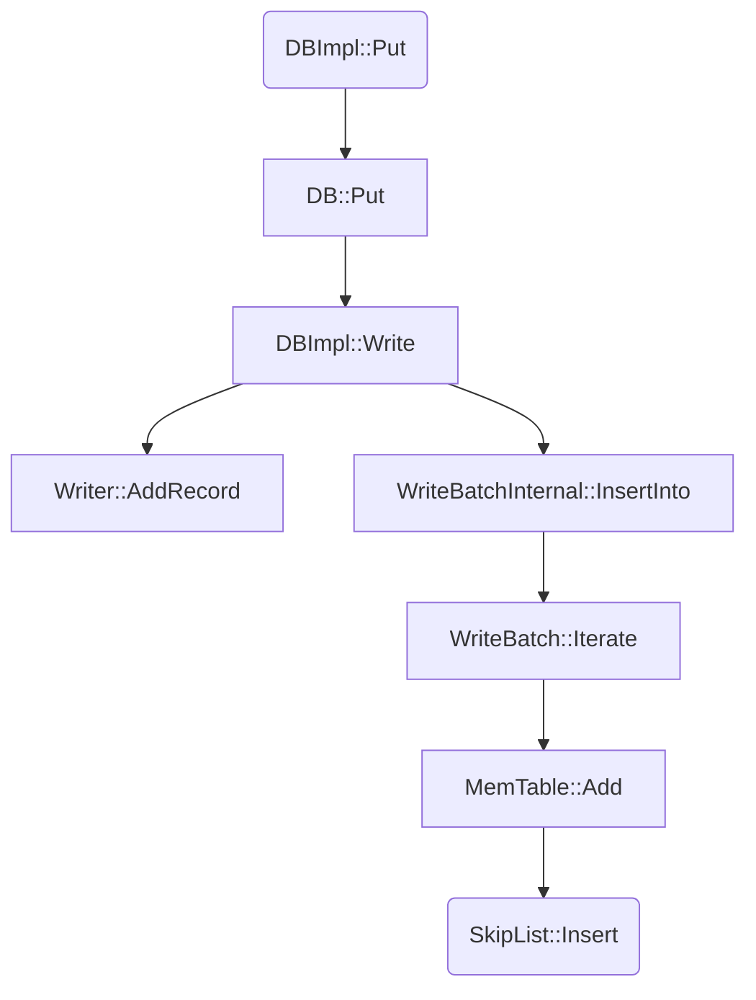

## 写流程

### 插入到 MemTable

#### 流程图

```mermaid
graph TB
    A(DBImpl::Put) --> B[DB::Put]
    B --> C[DBImpl::Write]
    C --> D[Writer::AddRecord]
    C --> E[WriteBatchInternal::InsertInto]
    E --> F[WriteBatch::Iterate]
    F --> G[MemTable::Add]
    G --> H(SkipList<Key, Comparator>::Insert)
```

#### 具体代码分析

